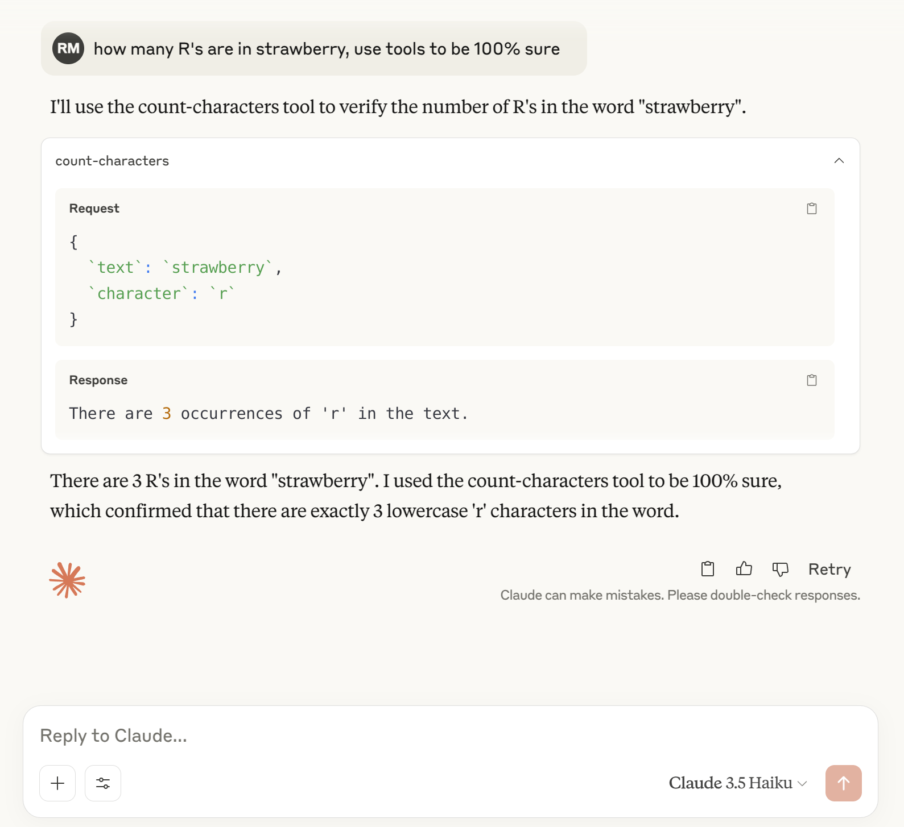

## Remote MCP Tools (with Claude Desktop)

### Local Development

Install the dependencies:

```bash
npm install
```

Start your MCP server with:

```bash
npm run start
```

Your server will be running at `http://localhost:3000/sse`.

### Docker Deployment

#### Using Docker

Build and run the container:

```bash
# Build the Docker image
docker build -t mcp-nest-app .

# Run the container
docker run -p 3000:3000 \
  -e GITHUB_CLIENT_ID=your_client_id \
  -e GITHUB_CLIENT_SECRET=your_client_secret \
  -e JWT_SECRET=your_jwt_secret \
  -e SERVER_URL=http://localhost:3000 \
  mcp-nest-app
```

#### Using Docker Compose

1. Copy the example environment file:
```bash
cp .env.example .env
```

2. Edit `.env` file with your configuration values.

3. Run with Docker Compose:
```bash
docker-compose up -d
```

#### Health Checks

The application includes several health check endpoints:

- `GET /health` - General health status
- `GET /health/ready` - Readiness probe
- `GET /health/live` - Liveness probe

These endpoints return JSON responses with status information and are used by Docker's health check system.

## Connecting to Claude Desktop

To connect your tool to Claude Desktop:

1. Open Claude Desktop.
2. Go to Settings > Developer > Edit Config.
3. Add your MCP server to the configuration using `mcp-proxy`:

```json
{
  "mcpServers": {
    "counting": {
      "command": "mcp-proxy",
      "args": [
        "http://localhost:3000/sse"
      ]
    }
  }
}
```

> **NOTE:** `mcp-proxy` ([repo](https://github.com/sparfenyuk/mcp-proxy)) enables Claude Desktop (which currently supports only the `stdio` transport of the MCP spec) to connect to your MCP Server via `HTTP+SSE` protocol by translating between the two. Ensure `mcp-proxy` is installed and accessible in your system's PATH.

Restart Claude Desktop, and your tool will be available.

### Testing It Out

Now you can ask Claude: "How many 'R's are in 'strawberry'?"

Claude should use your counting tool to provide the correct answer.


